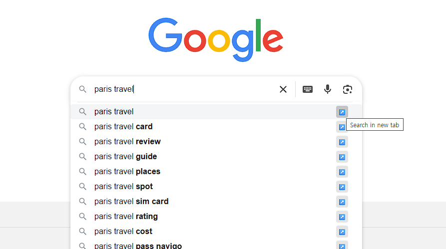
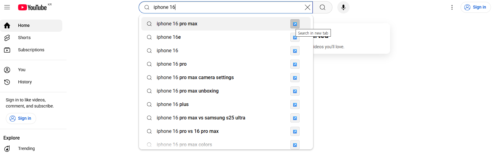

# Google & YouTube New Tab Search 🚀

https://chromewebstore.google.com/detail/googleyoutube-autocomplet/pmabbdlbkndeemogalkifoehafgckaag?authuser=0&hl=ko

Open the Google and YouTube search autocomplete proposal on a new tab with Chrome extensions.




## ✨ Features

- Adds a button next to **Google/YouTube** autocomplete suggestions
- Click the button to open the suggestion in a **new tab**
- Quickly explore multiple search terms without losing your current context

---

## 🛠 Tech Stack

- [Vite](https://vitejs.dev/)
- [TypeScript](https://www.typescriptlang.org/)
- [Manifest V3](https://developer.chrome.com/docs/extensions/mv3/)
- [Chrome Extensions API](https://developer.chrome.com/docs/extensions/)

## 📦 Requirements

- **Node.js v22**

  > ⚠️ This project requires Node.js version 22.

  If you're using `nvm`:

  ```bash
  nvm install 22
  nvm use 22
  ```

## 🚀 Getting Started

1. install Dependencies:

```bash
pnpm install
```

2. Run the Dev Server:

```bash
pnpm dev
```

### 🧩 Load the Extension in Chrome

1. Open `chrome://extensions/` in your Chrome browser
2. Enable **Developer Mode** (toggle in the top-right corner)
3. Click **Load unpacked**
4. Select the `dist` folder (or the appropriate build output directory)

---
